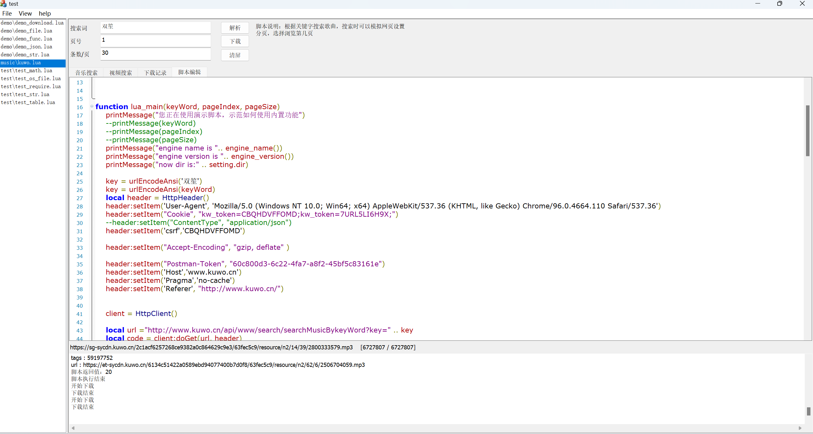
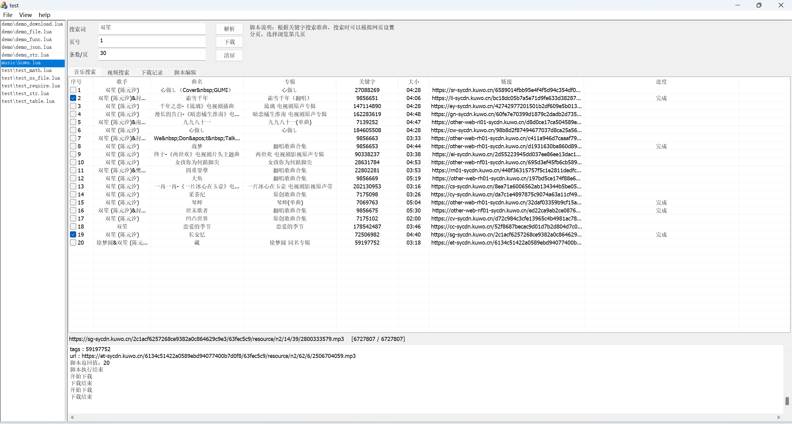

# MediaDownloader
**为了防止项目名称过于敏感，我还是决定将程序叫做http workshop，**

**也就是说这个程序主要为了在http开发过程做相关的各种工作，而不仅是爬资源下载。**

## 1. 起因

在以往的爬虫项目中，因为对方网站架构或者网页结构的不停变动，就需要不停的调整爬虫的解析数据的逻辑；如果用C++完成基础功能，用LUA脚本完成业务逻辑，这样就可以灵活的变动；

爬虫项目大多用于企业后台工作，爬取网络数据，但是对于个人用户选择音乐或者视频等应用，并不适合无界面的python技术路线，以及部署nodejs等web架构的程序；换句话说，除了爬数据的企业，某些时候爬虫只是程序员自娱自乐的工具；

总之，postman一类的产品，个人觉得脚本功能受限；爬虫部署和使用不适合普通人；那有人就说了，脚本同样不适合普通人使用啊，确实是这样，不过单个的脚本分发比python部署还是容易的多；整个这个项目的灵感还是来源于之前用过的一个叫autoJS的小工具。

## 2. 优点

1）项目用VC++/MFC编写界面，liburl库实现http访问，json11做json编解码，使用Scintilla作为编辑器，十分轻便；

2）项目编译后是二进制程序，执行速度快；方便部署；用户之间可以直接交流脚本即可直接应用；

3）用LUA编写数据解析的逻辑便于随网站调整解析逻辑；使用脚本或者dll可以灵活扩展功能；

##  3. 功能

1)   http 请求数据功能（GET)；支持自定义header项；

2） 编码和解析json格式数据；

3） 本地文件访问功能（限制为指定目录范围）；

4）支持LUA语法的脚本编辑器；

## 4. 如何使用

1）在可执行程序的同级script或者子目录script中添加相关脚本，具体函数参考doc下的《lua函数接口定义.md》。

2） 如果是API测试，直接点 “解析”按钮，输出信息显示在下侧的输出栏；

3）如果是音乐资源查找，先选择某一个脚本，点 “解析”按钮，执行脚本返回数据条目，

4) 在界面勾选合适的条目，点下载按钮，等待完成；

## 5. 扩展

